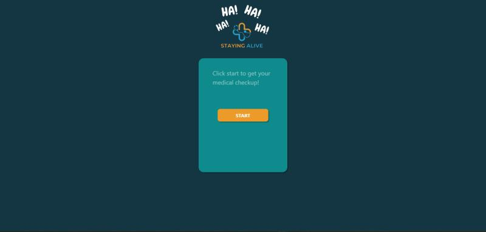
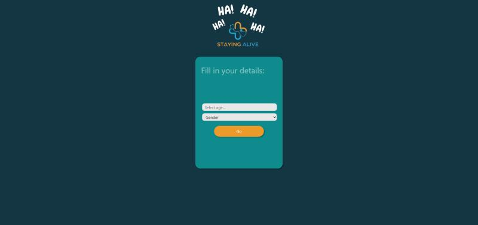
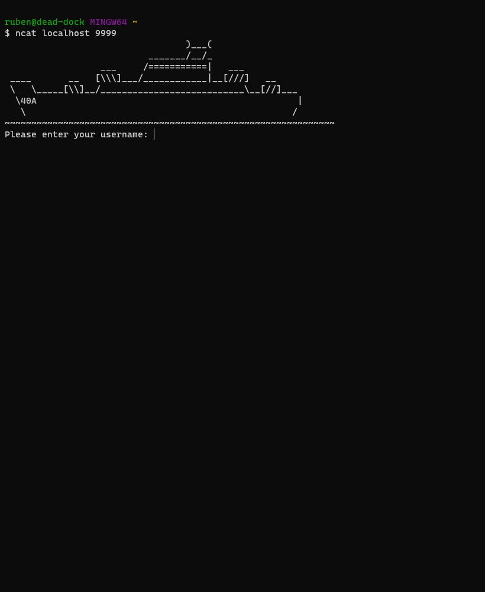
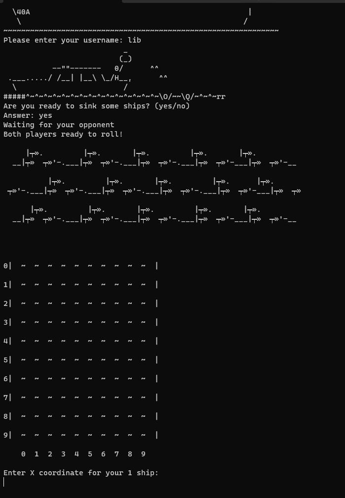
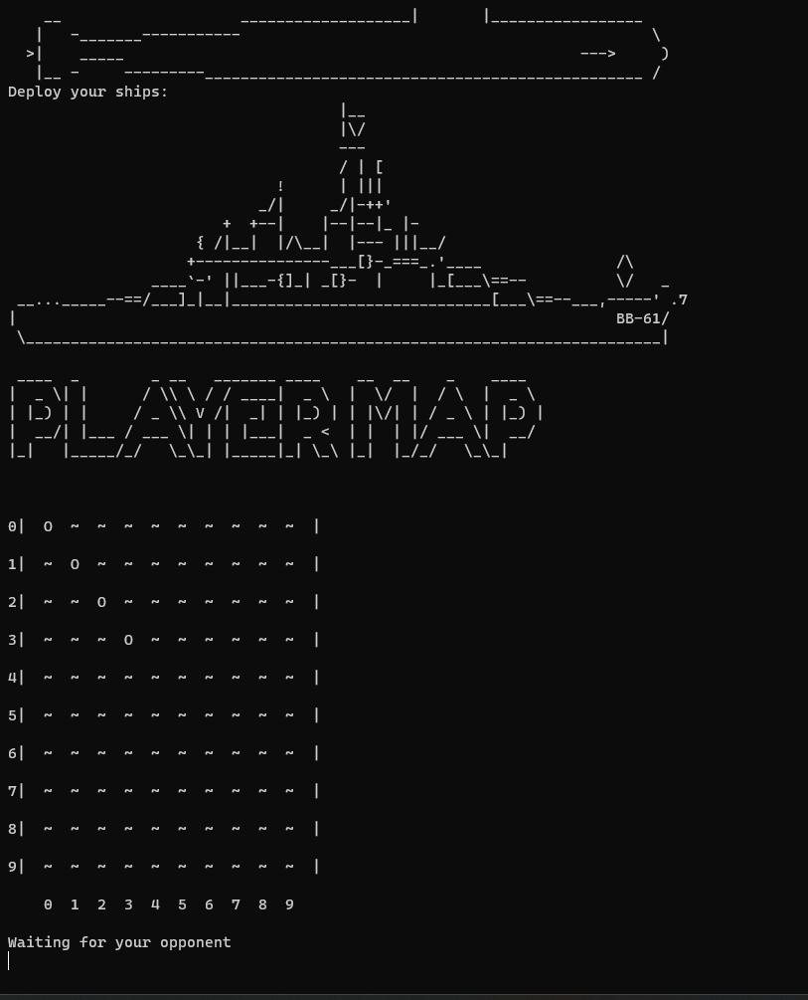
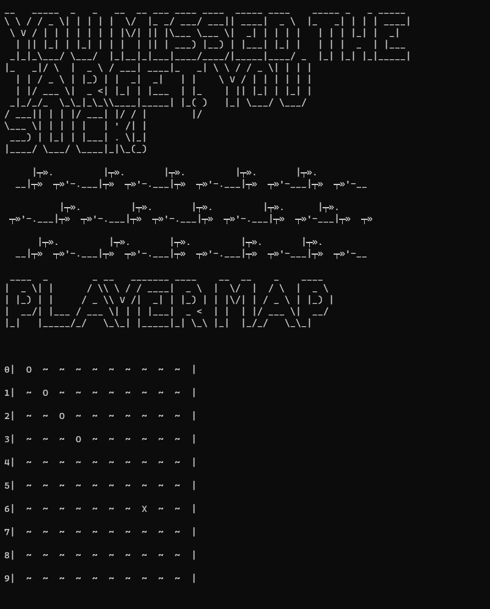
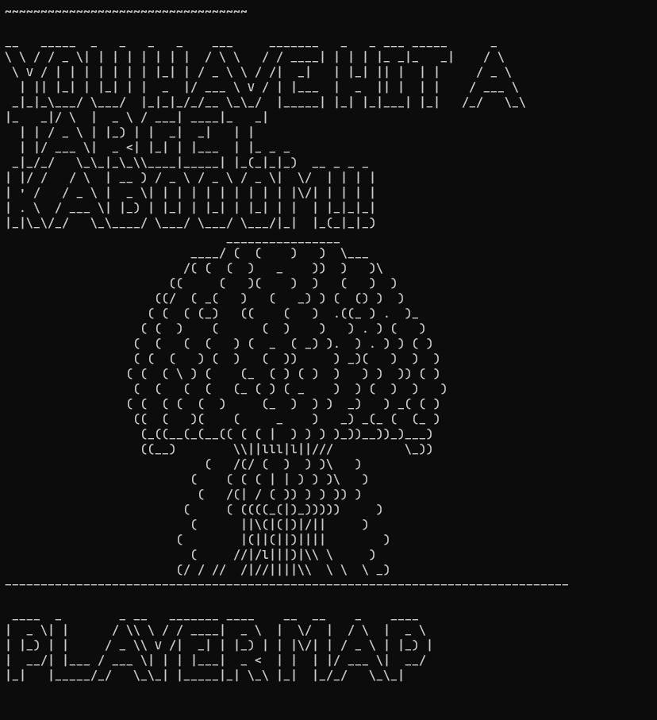
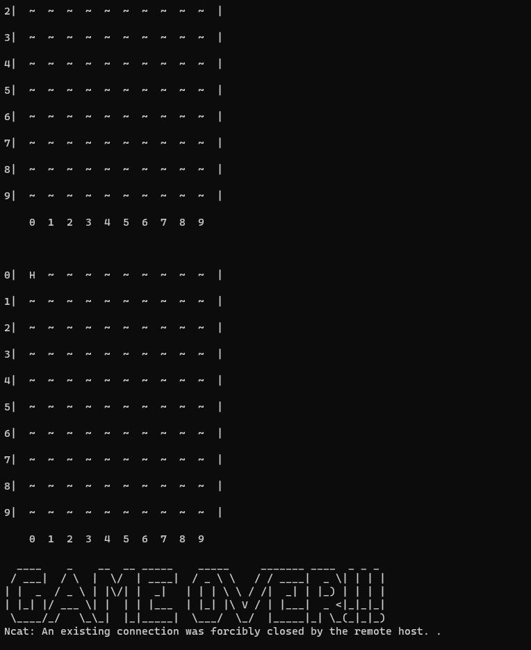

<h1>🗃️This repository is where I saved some of my milestone projects, I hope you enjoy them as much as I enjoyed making them.🖥️</h1>
<h2>Content description:</h2>

----------------------------------------------------------

<h2>
File name: gamejam.7z

Key features Java implementation, grid layout, dynamic messages, and winning condition 
</h2>
<h4>-A Drinking Boardgame written in Java in 10 days for a Gamejam, it can be played by up to 4 players, where the main objective is to land precisely on the starting tile after going around the board, the first player to do so wins, and every tile on the board has either a challenge, reward or penalty depending on where each player landed.</h4>

----------------------------------------------------------

<h2>
File name: spa.zip

-A Single Page Application written in JavaScript and made in 24 hours using web-API's and mini-scrum management framework</h2>
<h4>-This app was made to deliver a diagnosis after symptoms of an ailment have been inserted in the text box, multiple symptoms can be inserted to get a more precise diagnosis.</h4>

----------------------------------------------------------

<h2>
File name: battleShipCode-main.zip

-Key Features: TCP-based Server-Client Connection, Concurrency in Java, Dynamic UI, Interactive Feedback;
</h2>
<h4>-This Battleship game was developed in just two days, this Java-based game delivers an exhilarating experience with TCP-based server-to-client connections, allowing two players to engage in strategic naval warfare.</h4>
